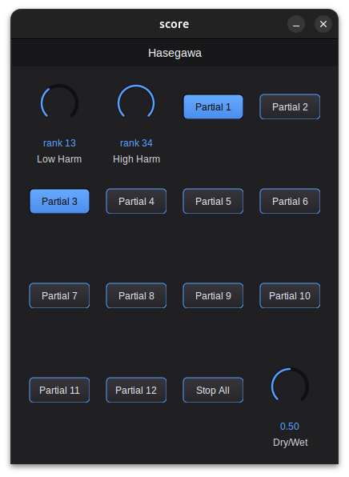

# Hasegawa

A **virtual-fundamental harmonizer** audio plugin (phase-vocoder based), built
with [Avendish](https://github.com/celtera/avendish) using
[TimeMachine](https://github.com/edumeneses/TimeMachine) as a template.



## Concept

Robert Hasegawa (2006; 2008; 2009) has proposed that complex harmonies, such
as those found in Schoenberg and Grisey, can be understood as upper partials
of a hypothetical *virtual fundamental*. This plugin turns that analytical
model into a real-time instrument: the incoming pitch is aleatorically
assigned a harmonic rank, and the plugin harmonizes it with up to 12
additional pitches drawn from the same harmonic series; when the ranks sit
high enough in the series, the sense of tonality may become obscured. Each of
the 12 harmonized pitches is an individually switchable voice with its own
output channel.

Since the ideal harmonic series is infinite, any combination of notes can be
described as harmonics of some fundamental; the analysis only becomes
musically meaningful, however, within a finite range determined by auditory
perception. In Hasegawa's nomenclature, Eb1(13:17:18:20) can be a relevant
representation of a complex harmony, while Eb-3(73:98:112:157) cannot: its
hypothetical fundamental falls well below the range of human hearing, and the
relations among its designated partials are too complex to be intelligible.
Recognizing that intervals built from higher integers become difficult to
comprehend, Hasegawa limits his tone representations to the first 34 partials
(2009); the plugin adopts the same limit.

The instrument explores the hypothesis that complex harmonies analyzable as
partials of a virtual fundamental, within a perceptually relevant range,
exhibit a greater degree of perceptual coherence, a quality we can call
*virtual toneness*; harmonies that resist such analysis exhibit less
coherence, or *virtual noisiness*. In other words, the instrument extends the
tone-noise axis explored by composers such as Lachenmann and Saariaho into
the domain of spectral implication described by Hasegawa. Drawing the
harmonic ranks from low in the series produces strong fusion and quasi-tonal
sonorities; drawing them from high in the series produces obscure, noisy
ones; the *Low Harm* and *High Harm* controls sweep along exactly that axis.

## How it works

The plugin is a **real-time harmonizer** with **12 individually switchable
partials**, each rendered to its **own mono output channel** (a master channel
carries a mono mix). Nothing is recorded or frozen: an open partial
continuously pitch-shifts the live input until it is closed.

1. **Aleatoric anchor** — when the first partial opens, a harmonic rank
   `r` (the *anchor*) is drawn uniformly at random from
   `[Low Harm, High Harm]`. The incoming pitch is *declared* to be partial
   `r` of a virtual fundamental `f0 = f_input / r`. The anchor holds as long
   as at least one partial is open, so everything sounding belongs to one
   series; it is cleared when all partials close (or on *Stop All*).
2. **Opening a partial** — toggling *Partial N* on draws that voice's rank
   `rank_N` from the same `[Low Harm, High Harm]` range (distinct from the
   anchor and from the other open partials whenever the range allows) and
   opens a voice at `f_N = f0 · rank_N`: a pitch shift of the live input by
   the just ratio `rank_N / r`. Toggling it off closes the voice.
3. **Resynthesis** — each voice is a phase-vocoder transposition of the live
   input (STFT 2048, hop 512, Hann). The analysis stage — one forward FFT per
   hop — is shared by all voices; each open voice scatters the analyzed
   spectrum to its pitch-scaled bins with its own running synthesis phase and
   renders through its own inverse FFT + overlap-add to its own channel.

The ratios are pure rank arithmetic (`rank_N / r`), so the harmonizer tracks
whatever the input does — dynamics, timbre, glissandi — as parallel just-ratio
transposition, in real time (latency: one STFT window, ~43 ms at 48 kHz).

Because every voice is a *just* ratio of small-to-moderate integers over a
common virtual fundamental, the resulting chord is a literal cutting of the
harmonic series — coherent ("virtually tonal") when the ranks are low and
close, increasingly obscure ("virtually noisy") as the ranks climb toward 34.

## Controls

| Control            | Range  | Function |
|--------------------|--------|----------|
| **Low Harm**       | 1 – 34 | Lowest harmonic rank eligible for the aleatoric draw. |
| **High Harm**      | 1 – 34 | Highest harmonic rank eligible for the aleatoric draw. |
| **Partial 1 – 12** | toggle | On: draw a rank and open that voice (real-time harmonization of the live input on its own output channel). Off: close it. Cycle off/on to redraw. |
| **Stop All**       | bang   | Closes every partial and clears the series anchor. Partial toggles left on stay closed until cycled off/on. |
| **Dry/Wet**        | 0 – 1  | Crossfade, on the master channel only, between the live input and the mono mix of all partials. |

This maps the original message-based specification
(`play <bufferNumber> <number_of_harmonics> <low_harm> <high_harm>`, `stop`
per partial, `stopAll`) onto plugin parameters: each partial toggle plays or
stops one voice (`bufferNumber` = which toggle; `number_of_harmonics` = how
many toggles you open), and `low_harm` / `high_harm` are read from the knobs
at the moment a partial opens.

## Audio I/O

The buses are dynamic — the plugin adapts to however many channels the host
provides (a fixed 13-channel bus crashes hosts that hand the plugin a stereo
buffer, so the channel count is negotiated instead):

- **Input**: channel 1 is the harmonizer source (mono); extra input channels
  are ignored.
- **Output**, up to 13 channels used:
  - channel **1**: master (mono mix of all partials, normalized by
    1/√(open partials) and crossfaded with the dry input by *Dry/Wet*);
  - channels **2 – 13**: partials 1 – 12, each the pure (wet) output of one
    voice, always at full level regardless of *Dry/Wet*.

On a plain stereo track you hear the master on channel 1 (and partial 1 on
channel 2). For the full fan-out — e.g. per-partial spatialization — give the
plugin 13 channels: in REAPER, set the track channel count to 16 (nearest
even ≥ 13) and route with the plugin pin editor; partials without a host
channel simply stay in the master mix.

## Download

Pre-built VST3 plugins for Windows, Linux and macOS are published as a rolling
"Continuous build" release. Grab the latest from the
[Releases page](../../releases/tag/continuous).

## Build

`CMakeLists.txt` follows the upstream template (`avnd_addon_init` /
`avnd_addon_object` / `avnd_addon_finalize`) and fetches **Avendish** and
**pffft** automatically. You provide a C++20 compiler, the **Steinberg VST3
SDK**, and **Boost** headers:

```bash
git clone --recursive https://github.com/steinbergmedia/vst3sdk

cmake -S . -B build \
  -DCMAKE_BUILD_TYPE=Release \
  -DVST3_SDK_ROOT="$PWD/vst3sdk" \
  -DBOOST_ROOT=/path/to/boost \
  -DSMTG_ENABLE_VSTGUI_SUPPORT=OFF -DSMTG_ADD_VSTGUI=OFF \
  -DSMTG_CREATE_PLUGIN_LINK=OFF

cmake --build build --target avnd_hasegawa_vst3
```

The compiled VST3 bundle is written under `build/vst3/avnd_hasegawa.vst3`.

The exact, reproducible build for every platform lives in
[`.github/workflows/build_cmake.yml`](.github/workflows/build_cmake.yml),
which mirrors ossia's `avnd-addon` recipe and produces the rolling release.
(The upstream template drives CI from ossia's reusable workflow; that
workflow's access is org-restricted, so this fork ships an equivalent
self-contained build instead.)

## References

- Hasegawa, R. (2006). "Tone Representation and Just Intervals in
  Contemporary Music." *Contemporary Music Review* 25(3), 263–281.
- Hasegawa, R. (2008). *Just Intervals and Tone Representation in
  Contemporary Music.* PhD dissertation, Harvard University.
- Hasegawa, R. (2009). "Gérard Grisey and the 'Nature' of Harmony."
  *Music Analysis* 28(2–3), 349–371.
